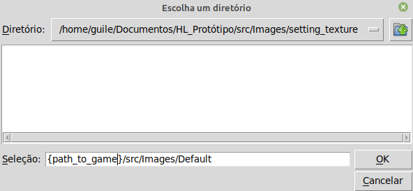

                                                               **Setting Texture
---

To run:
  * The filenames cannot be pruned, only the image can be edited. If you're going    to make your texture pack, clone the default and change the images without changing the name.
  * Don't forget to unzip the folder
  * Choose the filepath using the file tc.py.
  * (:

